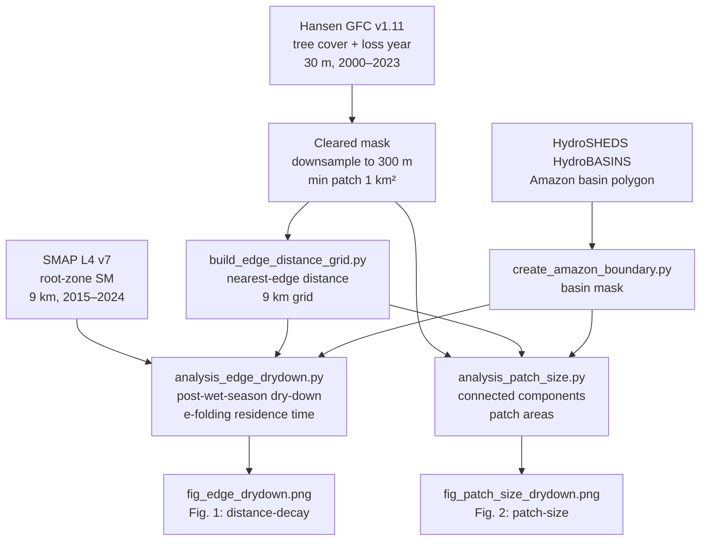

# Companion Code — *Deforestation Edge Effects on Soil Moisture Persistence in the Amazon Basin: Observational Evidence for Lateral Hydrological Degradation and Minimum Viable Restoration Scales*

[](https://doi.org/10.5281/zenodo.20339594)

**Author:** Ali Bin Shahid · ORCID [0009-0003-9709-4241](https://orcid.org/0009-0003-9709-4241)
**Affiliation:** PSKL Water for All, Islamabad, Pakistan
**Paper status:** In preparation (preprint pending)
**Code DOI:** [10.5281/zenodo.20339594](https://doi.org/10.5281/zenodo.20339594) (all-versions)

---

## What this repository is

Analysis code and derived data for the above paper. The study combines 10 years of SMAP Level 4 root-zone soil moisture (9 km, 2015–2024) with Hansen Global Forest Change data (30 m) to quantify how proximity to deforestation edges affects soil moisture persistence in intact Amazon forest.

Two questions are addressed:

1. **Does proximity to deforestation edges measurably degrade soil moisture persistence in adjacent intact forest, and if so, how far does the effect penetrate?**
   Distance-decay analysis across six bins from edge-adjacent (0–9 km) to deep interior (>144 km).
2. **Does the size of the nearest clearing independently predict the magnitude of the edge effect on neighbouring forest?**
   Patch-size analysis across seven clearing-area bins from 1 km² to >1,000 km².

Headline result: forest within 9 km of a substantial clearing dries eight times faster than forest more than 144 km from any edge; the e-folding moisture residence time increases from 13.6 months at the edge to 56.8 months in the deep interior.

---

## Analysis pipeline



---

## Repository structure

```
.
├── scripts/
│   ├── create_amazon_boundary.py        # Build Amazon basin mask from HydroBASINS
│   ├── download_deforestation.py        # Fetch Hansen GFC tiles
│   ├── download_deforestation_v2.py     # Hansen download (refined)
│   ├── build_edge_distance_grid.py      # Compute nearest-edge distance per 9 km cell
│   ├── analysis_edge_drydown.py         # Distance-binned dry-down analysis (Fig. 1)
│   ├── analysis_patch_size.py           # Clearing-size analysis (Fig. 2)
│   └── domains.py                       # Shared domain/grid definitions
├── figures/
│   ├── fig_edge_drydown.png             # Figure 1
│   └── fig_patch_size_drydown.png       # Figure 2
├── data/
│   └── README.md                        # Data sources and download instructions
├── requirements.txt
├── LICENSE
└── README.md
```

---

## Reproducing the analysis

### 1. Install dependencies

```bash
pip install -r requirements.txt
```

### 2. Download raw data

See `data/README.md`. The full pipeline requires ~3 GB of Hansen GFC tiles, ~20 MB of SMAP L4, and the HydroSHEDS Amazon basin polygon.

### 3. Run scripts in order

```bash
python scripts/create_amazon_boundary.py
python scripts/download_deforestation_v2.py
python scripts/build_edge_distance_grid.py
python scripts/analysis_edge_drydown.py
python scripts/analysis_patch_size.py
```

---

## Data sources

| Dataset | Source | URL |
|---|---|---|
| SMAP L4 v7 root-zone soil moisture | NASA Earthdata | https://earthdata.nasa.gov |
| Hansen GFC v1.11 (tree cover + loss year) | UMD GLAD via Google Earth Engine | https://storage.googleapis.com/earthenginepartners-hansen/GFC-2023-v1.11 |
| HydroSHEDS HydroBASINS Level 1 | WWF / HydroSHEDS | https://www.hydrosheds.org |

---

## License

Code: MIT (see LICENSE).

## AI disclosure

Portions of the associated manuscript were drafted and edited with AI language model assistance. All scientific analysis, interpretation, and responsibility for claims rest with the author.
